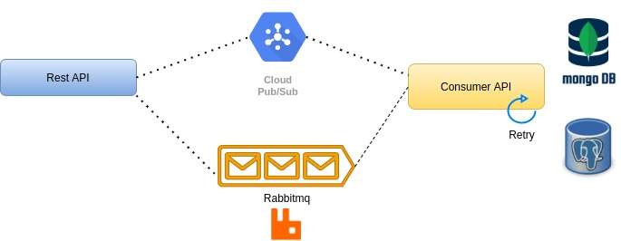

## Event Driven Application

### Stack

   * Spring Boot WebFlux
   * Rabbitmq
   * PubSub
   * Mongo
   * Postgres
   * R2bdc
   * Retry
   * Spring Cloud Binder
   * String Cloud Streamer
   * Reactive Programming
   * Http Client Feign
   * Web Client

### References

[REST Client Feign](https://cloud.spring.io/spring-cloud-netflix/multi/multi_spring-cloud-feign.html)

[R2bdc](https://spring.io/projects/spring-data-r2dbc)

[WebClient](https://www.baeldung.com/spring-5-webclient)

[Rabbitmq Spring](https://spring.io/guides/gs/messaging-rabbitmq/)

[Cloud Pub/SubSpring](https://spring.io/guides/gs/messaging-gcp-pubsub/)

[Reactive Programming](https://www.baeldung.com/spring-webflux)